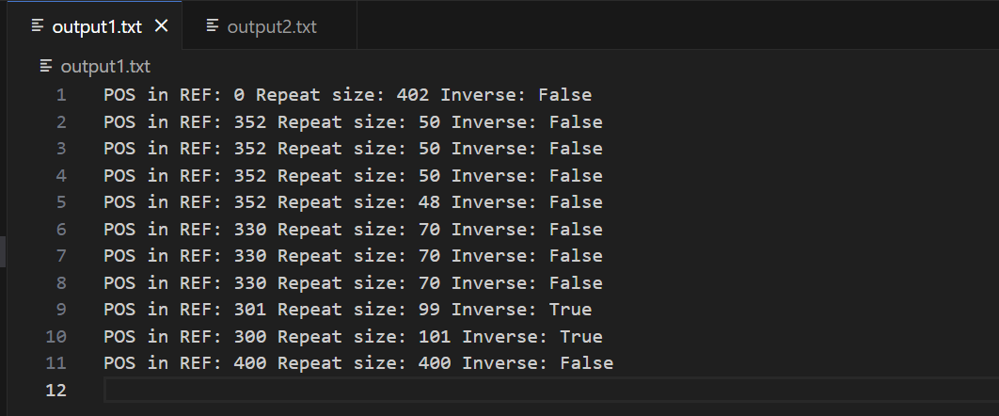

# 算法设计与分析 lab1 实验文档

姓名：项正豪  学号：23307130156

github仓库地址：https://github.com/xzh2004/Algorithm

## 伪代码

```plaintext
ref = input()
query = input()

struct Refseq{
	start, end, reverse
}
struct Trace{
	refseq, next
}

# Preprocessing for ref
for start = 1 to len:
	for end = i to len:
		map[hash(start, end, reverse = false)] = Refseq(start, end, true)
		map[hash(start, end, reverse = true)] = Refseq(start, end, false)

# Dynamic Planning for query
# Let dp[i] denote the farthest position that can be matched starting from position i
let dp[query_len] be new array
dp[quert_len] = 0
for start = len - 1 downto 0:
	hash_now = 0
	for end = start to len:
		hash_now = (hash_now * 5 + convert_dna_to_num(query[end])) % MOD
		if hash_now is in map:
			if (dp[start] > dp[end + 1] + 1) or 
				(dp[start] == dp[end + 1] + 1 and not reverse):
				dp[start] = dp[end + 1]
				chain[start] = Trace(ref_seq, end + 1)

# find the chain
pos = 0
result = []
while pos < quert_len:
	if chain[pos] is none: 
		return no answer
		quit
	put chain[pos] into result
	pos = chain[pos].next

# output
for x in result
	print(x.start, x.end - x.start + 1, x.reverse)
```

## 时间复杂度分析

设ref的长度为n，query的长度为m

preprocessing for ref: O(n^2)

dp for query: O(m^2)

find the chain:  < O(m)

output：< O(m)

所以总时间复杂度为平方量级

## 运行结果截图




## 运行结果说明

结果和样例输出略有出入，比如我的第二个输出从352开始，但样例从350开始。这是因为dp在query序列从头到尾的运行过程中，优先选择当前能够匹配的最长序列，所以从0直接匹配到了402，而不是400，这便导致了第二个从352开始。但整体上和样例输出差别不大。

## 代码运行说明

本lab采用python语言

在终端中输入：

```bash
cat input1.txt | python dna.py > output1.txt
cat input2.txt | python dna.py > output2.txt
```

即可在output1.txt和output2.txt中查看输出结果